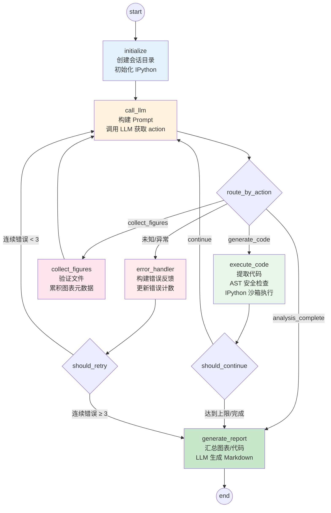
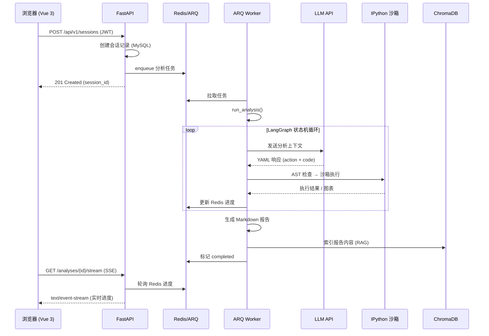

# 数据分析智能体 (Data Analysis Agent)

🤖 **企业级 LLM 驱动的智能数据分析平台**

[](https://python.org)
[](LICENSE)
[](https://fastapi.tiangolo.com)
[](https://vuejs.org)
[](https://docs.docker.com/compose/)
[](https://langchain-ai.github.io/langgraph/)

## 📋 项目简介

数据分析智能体是一个企业级的 AI 数据分析平台，支持用户通过**自然语言**描述分析需求，系统自动生成并安全执行 Python 数据分析代码，产出可视化图表与专业分析报告。目前已从 v1.0 CLI 工具演进为 v2.0 全栈 Web 应用。

- 🎯 **自然语言驱动**：用中文描述分析需求，LLM 自动规划分析步骤并生成代码
- 🔄 **多轮迭代分析**：基于 LangGraph 状态机实现 LLM 规划 → 代码生成 → 沙箱执行 → 图表采集 → 报告生成的自动化闭环
- 📊 **智能可视化**：自动生成高质量 matplotlib 图表，支持中文显示（SimHei 字体）
- 📝 **报告生成**：自动生成结构化 Markdown 报告，支持转为 Word 文档
- 🛡️ **安全沙箱**：AST 白名单检查，拦截 `exec`/`eval`/`subprocess` 等危险调用，保障 LLM 生成代码安全执行
- 🔍 **RAG 检索增强**：基于 ChromaDB 向量数据库对历史分析进行语义索引，在新分析中注入相似案例作为参考
- 👥 **多用户支持**：JWT 认证、会话隔离、用户级 LLM 配置
- ⚡ **实时进度流**：SSE 推送分析进度，前端实时展示

## 🏗️ 项目架构

```
data_analysis_agent/
├── daa/                        # v2 核心包
│   ├── api/v1/                 # FastAPI REST 端点
│   │   ├── auth.py             #   注册 / 登录 / Token 刷新
│   │   ├── users.py            #   用户资料管理
│   │   ├── sessions.py         #   分析会话 CRUD
│   │   ├── analyses.py         #   步骤查询 / 报告获取 / SSE 进度流 / 取消
│   │   ├── files.py            #   文件上传 / 列表 / 预览 / 删除
│   │   ├── configs.py          #   用户 LLM 配置管理
│   │   ├── rag.py              #   RAG 语义搜索
│   │   └── health.py           #   健康检查
│   ├── core/                   # 核心引擎（从 v1 utils/ 重构）
│   │   ├── executor.py         #   IPython 沙箱代码执行器
│   │   ├── safety.py           #   AST 白名单安全检查器
│   │   ├── protocol.py         #   YAML 协议解析与代码提取
│   │   ├── prompts.py          #   系统提示词模板（含 RAG 上下文注入）
│   │   ├── reporter.py         #   报告生成与保存
│   │   └── executor_registry.py # 执行器内存注册表（解决 IPython 不可序列化问题）
│   ├── workflow/               # LangGraph 状态机工作流
│   │   ├── graph.py            #   状态图构建与编译（MemorySaver checkpoint）
│   │   ├── state.py            #   AnalysisState TypedDict 定义
│   │   ├── edges.py            #   条件路由函数（action 路由 / 循环终止 / 错误重试）
│   │   └── nodes/              #   6 个工作流节点
│   │       ├── init_node.py    #     会话初始化
│   │       ├── llm_node.py     #     LLM 调用与 YAML 解析
│   │       ├── execute_node.py #     代码提取与安全执行
│   │       ├── collect_node.py #     图表元数据收集
│   │       ├── report_node.py  #     最终报告生成
│   │       └── error_node.py   #     统一错误恢复
│   ├── llm/                    # LLM 集成
│   │   ├── chat_models.py      #   ChatOpenAI 工厂（含故障转移）
│   │   └── prompts.py          #   LangChain ChatPromptTemplate 封装
│   ├── models/                 # SQLAlchemy ORM 模型（6 张表）
│   │   ├── user.py             #   用户表
│   │   ├── session.py          #   分析会话表
│   │   ├── analysis_step.py    #   分析步骤表
│   │   ├── analysis_file.py    #   上传文件表
│   │   └── user_config.py      #   用户 LLM 配置表
│   ├── services/               # 业务逻辑层
│   │   ├── analysis_service.py #   分析编排（LangGraph 流式执行 + Redis 进度推送）
│   │   ├── session_service.py  #   会话管理
│   │   ├── auth_service.py     #   JWT 编码 / 解码
│   │   ├── file_service.py     #   文件管理
│   │   ├── config_service.py   #   用户配置
│   │   ├── report_service.py   #   报告查询
│   │   └── rag_service.py      #   RAG 索引 / 检索
│   ├── db/                     # 数据库与缓存
│   │   ├── session.py          #   SQLAlchemy 异步会话工厂
│   │   └── redis.py            #   Redis 客户端 + Cache 工具类
│   ├── middleware/             # 中间件
│   │   ├── auth.py             #   JWT 认证依赖注入
│   │   ├── cors.py             #   跨域配置
│   │   ├── logging.py          #   请求日志
│   │   └── rate_limit.py       #   速率限制
│   ├── rag/                    # RAG 检索增强生成
│   │   ├── embedder.py         #   OpenAI Embeddings 封装
│   │   ├── splitter.py         #   文本分块器
│   │   ├── indexer.py          #   ChromaDB 索引器（4 类集合）
│   │   └── retriever.py        #   语义检索器 + 上下文格式化
│   ├── schemas/                # Pydantic 请求 / 响应模型
│   ├── workers/                # ARQ 后台任务
│   │   ├── worker.py           #   Worker 配置
│   │   └── tasks.py            #   分析任务定义 + RAG 索引触发
│   ├── main.py                 # FastAPI 应用工厂（lifespan 管理）
│   └── settings.py             # pydantic-settings 全局配置中心
├── frontend/                   # Vue 3 前端
│   └── src/
│       ├── api/                #   Axios API 层（auth / sessions / analyses / files / rag）
│       ├── stores/             #   Pinia 状态管理（auth / analysis）
│       ├── router/             #   Vue Router（含 auth guards）
│       ├── views/              #   页面组件（Dashboard / AnalysisCreate / Report / Files / Settings / RagSearch）
│       └── components/         #   通用组件（Layout）
├── tests/                      # 测试
│   ├── test_core/              #   核心模块测试（safety / executor / protocol）
│   └── test_workflow/          #   工作流路由测试
├── alembic/                    # 数据库迁移
├── scripts/init.sql            # MySQL 初始化 DDL
├── data_analysis_agent.py      # v1 DataAnalysisAgent 类（CLI 可用）
├── main.py                     # v1 CLI 入口
├── prompts.py                  # v1 系统提示词
├── config/llm_config.py        # v1 LLM 配置
├── pyproject.toml              # 项目元信息 + 依赖 + 工具配置
├── docker-compose.yml          # 六服务容器编排
├── Dockerfile                  # API / Worker 容器镜像
└── .env                        # 环境变量（API 密钥 / 数据库密码等）
```

## 🔄 系统架构与数据流

### 服务拓扑

```
┌──────────────┐     ┌──────────────┐     ┌──────────────┐
│   Frontend   │────▶│   FastAPI    │────▶│    MySQL     │
│  (Vue/Nginx) │     │   (uvicorn)  │     │    (8.0)     │
│   :3000      │     │   :8000      │     │   :3306      │
└──────────────┘     └──────┬───────┘     └──────────────┘
                            │
                  ┌─────────┼─────────┐
                  │         │         │
            ┌─────▼──┐ ┌───▼────┐ ┌──▼─────────┐
            │ Redis  │ │ Worker │ │  ChromaDB   │
            │  (7)   │ │ (ARQ)  │ │  (Vector)   │
            │ :6379  │ │        │ │  :8000      │
            └────────┘ └────────┘ └─────────────┘
```

### LangGraph 工作流状态机



### 请求生命周期



## ✨ 核心特性

### 🧠 LLM 驱动的分析引擎

- **YAML 协议**：LLM 响应采用结构化 YAML 格式，包含 `action`（generate_code / collect_figures / analysis_complete）、`reasoning`、`code`、`next_steps` 等字段
- **状态机编排**：LangGraph `StateGraph` + `MemorySaver` checkpoint，替代 v1 的 `while` 循环，支持断点续跑
- **6 节点工作流**：initialize → call_llm → execute_code / collect_figures / generate_report / error_handler
- **3 条条件路由**：action 路由、循环/终止判断、错误重试/放弃
- **故障转移**：主 LLM API 失败时自动切换到备用 API

### 🛡️ 多层安全防护

- **AST 白名单**：代码执行前走 AST，拦截 `exec`/`eval`/`open`/`os.system`/`subprocess` 等 20+ 种危险调用
- **导入白名单**：仅允许 pandas、numpy、matplotlib、duckdb、scipy、sklearn、plotly 等 40+ 个安全模块
- **IPython 沙箱**：隔离的 InteractiveShell 实例，与主机环境分离
- **迭代保护**：最大 20 轮自动终止，连续 3 次错误强制生成报告

### 🔍 RAG 检索增强

- **4 类向量集合**：`analysis_queries` / `analysis_code` / `analysis_reports` / `analysis_figures` 分库存储
- **语义检索**：当前查询向量化 → ChromaDB 余弦相似度搜索 → Top-K 历史案例注入 system prompt
- **自动索引**：分析完成后自动将报告、代码、图表描述索引到向量数据库

### ⚡ 实时流式体验

- **SSE 进度推送**：1 秒轮询 Redis，前端实时渲染进度条和当前轮次
- **会话管理**：创建、查看详情（含步骤 + 图表）、取消、删除
- **文件预览**：上传后自动检测列名和行数，浏览器端预览

### 🐳 一键部署

```bash
docker-compose up -d
```
6 个服务自动编排：Frontend + API + Worker + MySQL + Redis + ChromaDB

## 🚀 快速开始

### 方式一：Docker Compose（推荐）

```bash
# 1. 克隆项目
git clone https://github.com/GuirenCheng/data_analysis_agent.git
cd data_analysis_agent

# 2. 配置环境变量
cp .env.example .env
# 编辑 .env，填入 LLM_API_KEY 等信息

# 3. 一键启动
docker-compose up -d

# 4. 访问
# 前端: http://localhost:3000
# API 文档: http://localhost:8000/docs
```

### 方式二：本地开发

```bash
# 1. 安装依赖
pip install -e ".[dev]"

# 2. 配置环境变量
cp .env.example .env
# 编辑 .env

# 3. 初始化数据库（需要 MySQL 8.0）
alembic upgrade head

# 4. 启动 API 服务
uvicorn daa.main:app --reload --port 8000

# 5. 启动 ARQ Worker（另一个终端）
arq daa.workers.worker.WorkerSettings

# 6. 启动前端（另一个终端）
cd frontend && npm install && npm run dev
```

### CLI 模式（v1 兼容）

```bash
python main.py -f sales.csv -q "分析近五年营收趋势并生成图表"
```

## 🔧 配置说明

所有配置集中在 `.env` 文件中（详见 `.env.example`）：

| 配置项 | 说明 | 默认值 |
|--------|------|--------|
| `LLM_API_KEY` | LLM API 密钥 | - |
| `LLM_BASE_URL` | LLM API 地址 | `https://api.openai.com/v1` |
| `LLM_MODEL` | LLM 模型名称 | `gpt-4-turbo-preview` |
| `LLM_FALLBACK_*` | 备用 LLM 配置（可选） | - |
| `MYSQL_*` | MySQL 连接参数 | `localhost:3306` |
| `REDIS_URL` | Redis 连接 URL | `redis://localhost:6379/0` |
| `CHROMA_*` | ChromaDB 连接参数 | `localhost:8000` |
| `JWT_SECRET_KEY` | JWT 签名密钥 | - |
| `MAX_UPLOAD_SIZE_MB` | 上传文件大小限制 | 50 |
| `RAG_CHUNK_SIZE` | RAG 分块大小 | 800 |
| `RAG_TOP_K` | RAG 检索返回数 | 5 |

## 📊 支持的数据格式

- ✅ CSV（UTF-8 / GBK / GB18030 / GB2312 编码）
- ✅ Excel（.xlsx / .xls）
- ✅ JSON
- ✅ Parquet

## 🧪 测试

```bash
# 运行所有测试
pytest

# 仅运行核心模块测试
pytest tests/test_core/ -v

# 仅运行工作流测试
pytest tests/test_workflow/ -v
```

## 🛠️ 技术栈

| 层级 | 技术 |
|------|------|
| **前端** | Vue 3 + TypeScript + Vite + Pinia + Element Plus |
| **后端** | FastAPI (Python 3.11+) + Pydantic v2 |
| **AI 编排** | LangChain + LangGraph（StateGraph + MemorySaver） |
| **代码执行** | IPython InteractiveShell 沙箱 |
| **数据库** | MySQL 8.0 + SQLAlchemy 2.0 异步 + Alembic 迁移 |
| **缓存 / 队列** | Redis 7 + ARQ 任务队列 |
| **向量数据库** | ChromaDB（余弦相似度） |
| **Embedding** | OpenAI text-embedding-3-small（兼容 API） |
| **认证** | JWT (python-jose) + bcrypt (passlib) |
| **部署** | Docker Compose 六服务编排 |
| **测试** | pytest + pytest-asyncio |
| **代码质量** | black + isort + flake8 + mypy + pre-commit |

## 🚨 安全模型

代码执行前通过 `daa/core/safety.py` 进行多层检查：

| 检查层 | 拦截内容 |
|--------|---------|
| 导入白名单 | 仅允许 40+ 个安全模块导入 |
| 禁止导入 | subprocess, importlib, ctypes, socket, shutil, multiprocessing, threading, signal |
| 禁止函数 | exec, eval, compile, open, `__import__`, getattr, setattr, globals, locals, breakpoint |
| 禁止属性调用 | os.system, os.popen, subprocess.call, subprocess.run, subprocess.Popen, sys.exit |
| 迭代保护 | 最大 20 轮 + 连续 3 次错误自动终止 |

## 🐛 故障排除

**Q: 图表中文显示为方框？**
A: 确保安装了 SimHei 或 WenQuanYi Micro Hei 字体（Docker 镜像已预装）。

**Q: LLM API 调用失败？**
A: 检查 `.env` 中 `LLM_API_KEY` 和 `LLM_BASE_URL` 是否正确；配置 `LLM_FALLBACK_*` 可启用故障转移。

**Q: ChromaDB 连接失败？**
A: RAG 子系统设计了优雅降级——ChromaDB 不可用时自动跳过，不影响核心分析功能。

**Q: Docker 启动失败？**
A: 检查端口冲突（3000/8000/3306/6379/8000），确保 Docker Compose 版本 ≥ 3.9。

**Q: 数据加载编码错误？**
A: LLM prompt 中已要求自动尝试 `['utf-8', 'gbk', 'gb18030', 'gb2312']` 多种编码。

## 🔄 版本演进

### v2.0.0（当前版本）
- 🏗️ 全新 FastAPI Web 架构，替换 v1 CLI
- 🔄 LangGraph 状态机替代 while 循环
- 🔍 集成 ChromaDB RAG 检索增强
- 🎨 Vue 3 前端 + SSE 实时进度
- 🐳 Docker Compose 一键部署
- 👥 JWT 多用户认证
- ⚡ ARQ 异步任务队列
- 🗄️ MySQL + Alembic 数据持久化

### v1.0.0
- ✨ CLI 单用户模式
- 🎯 自然语言 → Python 代码生成
- 📊 matplotlib 图表自动生成
- 📝 Markdown + Word 报告
- 🔒 AST 安全沙箱

---

<div align="center">

**🚀 让数据分析变得更智能、更简单！**

</div>
